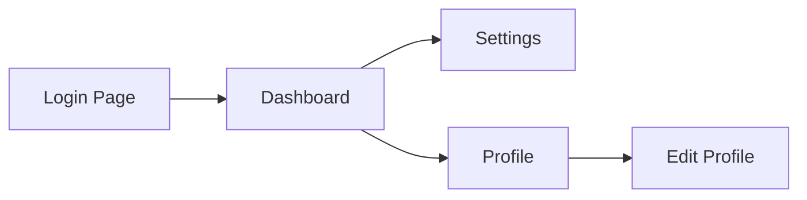

# Session Recorder - Export Features Tasks

**PRD:** [PRD-session-recorder.md](PRD-session-recorder.md)
**Parent Tasks:** [TASKS-session-recorder.md](TASKS-session-recorder.md)
**Last Updated:** 2025-12-11
**Overall Status:** Not Started
**Priority:** Low (Backlog)

---

## Table of Contents

- [Overview](#overview)
- [FR-5.2: Bug Report Export](#fr-52-bug-report-export)
- [FR-5.3: Test Code Generation](#fr-53-test-code-generation)
- [FR-5.4: Documentation Export](#fr-54-documentation-export)
- [FR-5.5: Features Export](#fr-55-features-export)
- [Implementation Architecture](#implementation-architecture)
- [Estimated Effort](#estimated-effort)

---

## Overview

This document covers the data export features for Session Recorder. These features transform recorded session data into various output formats for different use cases:

| Export Type | Target Users | Use Cases |
|-------------|--------------|-----------|
| Bug Reports | QA Engineers | Bug reproduction, issue tracking |
| Test Code | QA Engineers, Developers | Regression testing, E2E automation |
| Documentation | Technical Writers, Developers | Feature docs, knowledge transfer |
| Features | Product Managers, Analysts | Feature discovery, user flow mapping |

**PRD Reference:** [FR-5: Data Export](PRD-session-recorder.md#fr-5-data-export)

---

## FR-5.2: Bug Report Export

> **PRD Reference:** [FR-5: Data Export](PRD-session-recorder.md#fr-5-data-export)
> **Use Case:** [UC-3: Bug Reproduction](PRD-session-recorder.md#uc-3-bug-reproduction)

Export recorded sessions to bug tracking formats with reproduction steps, screenshots, and context.

### FR-5.2.1: Markdown Export ❌ NOT STARTED

- [ ] Generate markdown bug report template
- [ ] Include step-by-step reproduction instructions
- [ ] Embed screenshots (base64 or file references)
- [ ] Include environment details (browser, viewport, URL)
- [ ] Add timestamp information for each step
- [ ] Include voice transcript excerpts (if available)

**Output Format:**
```markdown
# Bug Report: [Session Title or Auto-generated]

## Environment
- **URL:** https://example.com/page
- **Browser:** Chrome 120
- **Viewport:** 1920x1080
- **Recorded:** 2025-12-11 10:30:00 UTC

## Steps to Reproduce
1. Navigate to https://example.com/page
   
2. Click on "Submit" button
   
...

## Expected Behavior
[To be filled by user]

## Actual Behavior
[To be filled by user]

## Additional Context
Voice narration: "The form should validate but instead shows..."
```

### FR-5.2.2: Jira Export ❌ NOT STARTED

- [ ] Generate Jira-compatible format (JSON or markup)
- [ ] Map session data to Jira fields (summary, description, steps)
- [ ] Support attachment references for screenshots
- [ ] Include reproduction steps in Jira markup format
- [ ] Add labels/components based on URL patterns
- [ ] Support custom field mapping configuration

### FR-5.2.3: Linear Export ❌ NOT STARTED

- [ ] Generate Linear-compatible format
- [ ] Map session data to Linear issue fields
- [ ] Support markdown formatting for description
- [ ] Include screenshot attachments
- [ ] Add labels based on session metadata

### FR-5.2.4: GitHub Issues Export ❌ NOT STARTED

- [ ] Generate GitHub Issues markdown format
- [ ] Include checkbox-style reproduction steps
- [ ] Embed screenshots (GitHub image syntax)
- [ ] Add appropriate labels/metadata as comments
- [ ] Support issue template format

---

## FR-5.3: Test Code Generation

> **PRD Reference:** [FR-5: Data Export](PRD-session-recorder.md#fr-5-data-export)
> **Use Case:** [UC-4: Regression Test Generation](PRD-session-recorder.md#uc-4-regression-test-generation)

Generate executable test code from recorded sessions for automated testing frameworks.

### FR-5.3.1: Playwright Test Generation ❌ NOT STARTED

- [ ] Generate Playwright TypeScript test file
- [ ] Convert recorded actions to Playwright commands
- [ ] Use captured selectors for element targeting
- [ ] Generate appropriate locator strategies (priority: data-testid > id > text)
- [ ] Add navigation commands for URL changes
- [ ] Include wait conditions based on action timing
- [ ] Generate assertions from voice transcript commands (e.g., "assert", "verify", "should")
- [ ] Support page object model generation (optional)

**Output Example:**
```typescript
import { test, expect } from '@playwright/test';

test('User login flow', async ({ page }) => {
  // Navigate to login page
  await page.goto('https://example.com/login');

  // Fill username
  await page.getByTestId('username-input').fill('testuser');

  // Fill password
  await page.getByTestId('password-input').fill('********');

  // Click login button
  await page.getByRole('button', { name: 'Login' }).click();

  // Assert: Verify dashboard is visible
  await expect(page.getByTestId('dashboard')).toBeVisible();
});
```

### FR-5.3.2: Cypress Test Generation ❌ NOT STARTED

- [ ] Generate Cypress JavaScript/TypeScript test file
- [ ] Convert recorded actions to Cypress commands
- [ ] Use captured selectors with cy.get()
- [ ] Add cy.visit() for navigation
- [ ] Include appropriate wait commands
- [ ] Generate assertions from voice commands
- [ ] Support custom commands generation (optional)

**Output Example:**
```typescript
describe('User login flow', () => {
  it('should login successfully', () => {
    cy.visit('https://example.com/login');

    cy.get('[data-testid="username-input"]').type('testuser');
    cy.get('[data-testid="password-input"]').type('********');
    cy.get('button').contains('Login').click();

    cy.get('[data-testid="dashboard"]').should('be.visible');
  });
});
```

### FR-5.3.3: Assertion Generation ❌ NOT STARTED

- [ ] Parse voice transcript for assertion keywords
- [ ] Map assertion keywords to test assertions:
  - "assert", "verify", "should" → visibility/existence checks
  - "equals", "contains", "matches" → value assertions
  - "enabled", "disabled" → state assertions
- [ ] Generate assertions based on DOM state changes
- [ ] Support custom assertion mapping configuration

### FR-5.3.4: Selector Optimization ❌ NOT STARTED

- [ ] Validate captured selectors still work
- [ ] Generate multiple selector strategies per element
- [ ] Prioritize stable selectors (data-testid, aria-label)
- [ ] Flag potentially brittle selectors (nth-child, complex paths)
- [ ] Support selector suggestion improvements

---

## FR-5.4: Documentation Export

> **PRD Reference:** [FR-5: Data Export](PRD-session-recorder.md#fr-5-data-export)
> **Use Cases:** [UC-1: Legacy Application Documentation](PRD-session-recorder.md#uc-1-legacy-application-documentation), [UC-2: Feature Documentation](PRD-session-recorder.md#uc-2-feature-documentation), [UC-5: Full Application Documentation](PRD-session-recorder.md#uc-5-full-application-documentation)

Export recorded sessions as user-facing documentation with screenshots and descriptions.

### FR-5.4.1: Markdown Documentation ❌ NOT STARTED

- [ ] Generate markdown documentation structure
- [ ] Create step-by-step guides with screenshots
- [ ] Include voice transcript as descriptive text
- [ ] Support table of contents generation
- [ ] Add navigation links between sections
- [ ] Support multiple session aggregation

**Output Example:**
```markdown
# Feature: User Authentication

## Overview
This guide walks through the user authentication process.

## Steps

### 1. Navigate to Login Page
Navigate to the login page at `/login`.


> "This is the main login page where users enter their credentials"

### 2. Enter Credentials
Fill in your username and password in the form fields.


...
```

### FR-5.4.2: HTML Documentation ❌ NOT STARTED

- [ ] Generate standalone HTML documentation
- [ ] Include embedded CSS styling
- [ ] Embed screenshots as base64 or relative paths
- [ ] Add navigation sidebar
- [ ] Support responsive layout
- [ ] Include search functionality (optional)

### FR-5.4.3: Confluence Export ❌ NOT STARTED

- [ ] Generate Confluence storage format (XHTML)
- [ ] Support Confluence macros for screenshots
- [ ] Map headings to Confluence structure
- [ ] Include table of contents macro
- [ ] Support page hierarchy for multi-session docs
- [ ] Add labels based on session metadata

### FR-5.4.4: Screenshot Integration ❌ NOT STARTED

- [ ] Include before/after screenshots per action
- [ ] Support thumbnail generation for overview
- [ ] Add screenshot captions from transcript
- [ ] Highlight action elements in screenshots (optional)
- [ ] Support image compression for export size

---

## FR-5.5: Features Export

> **Purpose:** Analyze recorded sessions to extract and catalog application features and user flows.

Generate a structured catalog of features and user flows discovered in recorded sessions.

### FR-5.5.1: Feature List Generation ❌ NOT STARTED

- [ ] Generate feature_list.json with discovered features
- [ ] Extract features from navigation patterns
- [ ] Identify distinct user flows from action sequences
- [ ] Map URLs to feature areas
- [ ] Include interaction counts per feature
- [ ] Support feature categorization

**Output Schema:**
```json
{
  "sessionId": "abc-123",
  "generatedAt": "2025-12-11T10:30:00Z",
  "features": [
    {
      "id": "auth-login",
      "name": "User Login",
      "category": "Authentication",
      "urls": ["/login", "/auth/login"],
      "actions": ["input", "click", "submit"],
      "interactionCount": 5,
      "transcript": "Login page where users authenticate..."
    }
  ],
  "userFlows": [
    {
      "id": "flow-1",
      "name": "Login to Dashboard",
      "steps": ["auth-login", "dashboard-view"],
      "duration": 15000
    }
  ]
}
```

### FR-5.5.2: User Flow Mapping ❌ NOT STARTED

- [ ] Identify distinct user journeys in sessions
- [ ] Map navigation sequences to flows
- [ ] Calculate flow duration and step counts
- [ ] Detect common patterns across multiple sessions
- [ ] Generate flow diagrams (mermaid syntax)

**Flow Diagram Output:**


---

## Implementation Architecture

### Export Service Design

```typescript
// Proposed structure: src/export/

export/
├── index.ts                    // Main export service
├── types.ts                    // Export type definitions
├── templates/                  // Export templates
│   ├── bug-report/
│   │   ├── markdown.ts
│   │   ├── jira.ts
│   │   ├── linear.ts
│   │   └── github.ts
│   ├── test-code/
│   │   ├── playwright.ts
│   │   └── cypress.ts
│   ├── documentation/
│   │   ├── markdown.ts
│   │   ├── html.ts
│   │   └── confluence.ts
│   └── features/
│       └── feature-list.ts
├── generators/                 // Code generation utilities
│   ├── selector-generator.ts
│   ├── assertion-generator.ts
│   └── screenshot-processor.ts
└── parsers/                    // Session data parsers
    ├── action-parser.ts
    ├── transcript-parser.ts
    └── navigation-parser.ts
```

### Export Interface

```typescript
interface ExportOptions {
  format: 'markdown' | 'jira' | 'linear' | 'github' |
          'playwright' | 'cypress' |
          'html' | 'confluence' |
          'feature-list';
  includeScreenshots: boolean;
  includeTranscript: boolean;
  screenshotFormat: 'embedded' | 'referenced';
  outputPath?: string;
}

interface ExportResult {
  success: boolean;
  outputPath: string;
  format: string;
  fileCount: number;
  totalSize: number;
}

async function exportSession(
  session: SessionData,
  options: ExportOptions
): Promise<ExportResult>;
```

---

## Estimated Effort

| Task | Hours | Priority |
|------|-------|----------|
| **FR-5.2: Bug Report Export** | | |
| Markdown Export | 3h | Medium |
| Jira Export | 4h | Medium |
| Linear Export | 3h | Low |
| GitHub Issues Export | 3h | Medium |
| **Subtotal** | **13h** | |
| **FR-5.3: Test Code Generation** | | |
| Playwright Generation | 6h | High |
| Cypress Generation | 4h | Medium |
| Assertion Generation | 4h | Medium |
| Selector Optimization | 3h | Medium |
| **Subtotal** | **17h** | |
| **FR-5.4: Documentation Export** | | |
| Markdown Documentation | 4h | High |
| HTML Documentation | 5h | Medium |
| Confluence Export | 4h | Low |
| Screenshot Integration | 3h | High |
| **Subtotal** | **16h** | |
| **FR-5.5: Features Export** | | |
| Feature List Generation | 4h | Low |
| User Flow Mapping | 5h | Low |
| **Subtotal** | **9h** | |
| | | |
| **Grand Total** | **~55h** | |

### Implementation Priority

1. **High Priority** (Immediate Value)
   - Playwright test generation (6h)
   - Markdown documentation (4h)
   - Screenshot integration (3h)

2. **Medium Priority** (Common Use Cases)
   - Markdown bug report (3h)
   - GitHub Issues export (3h)
   - Cypress generation (4h)
   - Assertion generation (4h)

3. **Low Priority** (Specialized Use Cases)
   - Jira/Linear exports (7h)
   - Confluence export (4h)
   - Feature list/flow mapping (9h)
   - HTML documentation (5h)

---

## Dependencies

- Session data must be loaded and accessible
- Screenshots must be available in session archive
- Transcript data required for assertion generation and documentation

---

## Document Change Log

| Version | Date | Changes |
|---------|------|---------|
| 1.0 | 2025-12-11 | Initial document created from TASKS-session-recorder.md |
